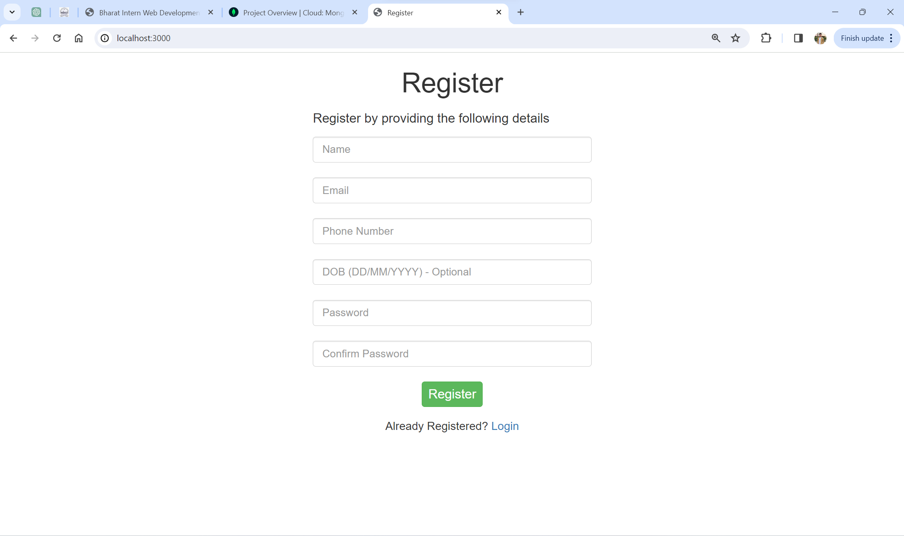
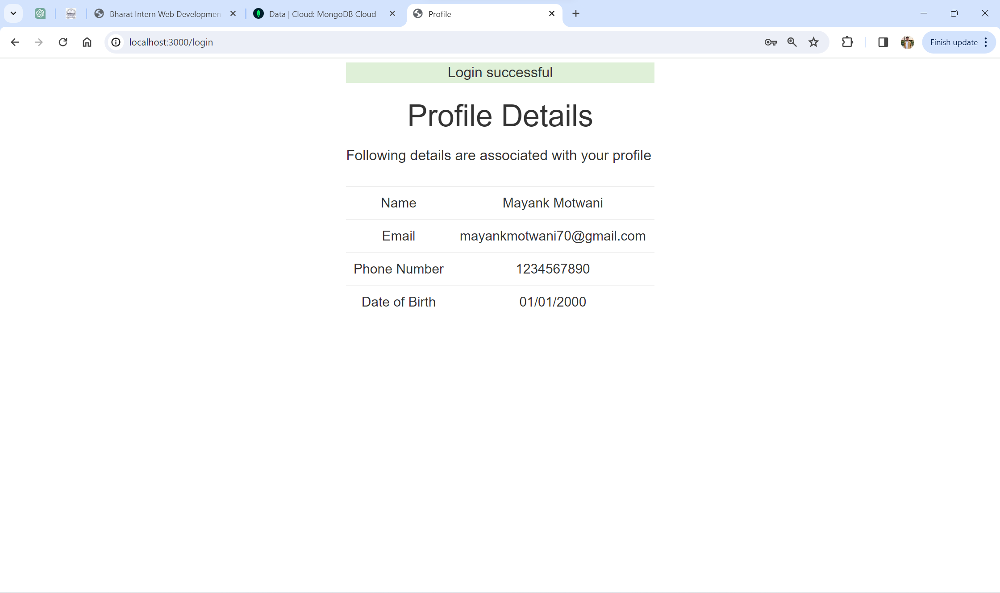
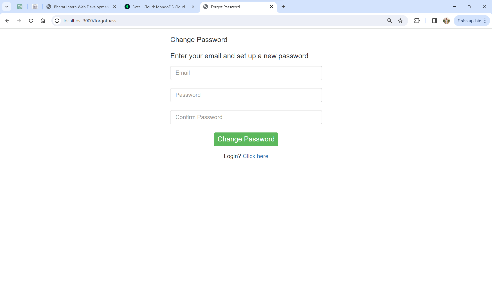

<h1 align="center">
  <b>User Registration & Login Systems<br /> using Node.js and MongoDB </b>
</h1>
<br />
This is a straightforward web application featuring a user-friendly registration form. Users can easily create profiles by filling in their details in the registration form. Following the registration, they can log in to their accounts using the credentials they provided during the sign-up process.
<br /><br />
The application is developed on the Node.js framework and integrates MongoDB (Atlas) as its database to manage user data. It utilizes the Express framework for effective routing, employs the body-parser module for request parsing, and integrates Mongoose to streamline interactions with the MongoDB database.

## Components

### • Registration Form:
Enables the user to register their profile by filling in their Name, Email ID, Phone Number, Date of Birth and the Password.



### • Login Form:
After registration, a user can login to their account by providing the credentials.


### • User Profile:
After a user has logged in, the details that the user entered while registration are displayed in a tabular form.



### • Password Reset:
In case a user forgets their password, they can reset it through the Forgot Password page by entering the registered Email ID and the new password.<br />
Note: An OTP based authentication mechanism should be added to this functionality for security.



### Database:
For the database **[MongoDB (Atlas)](https://www.mongodb.com/cloud/atlas)** has been used in this application.<br />
A collection named **Users** is created and populated with the data that user's enter while registration.

## Running the application
### Prerequisites
The following tools are required to run this application:

- [Node.js](https://nodejs.org/en/)
- [Node Package Manager](https://www.npmjs.com/get-npm)
- [MongoDB (Atlas)](https://www.mongodb.com/cloud/atlas)

### Installation
Download the repository and then open a terminal at the location of the directory.<br />
Run the following command to install the necessary modules.
```
npm install
```
### Connection to the database
Create a cluster in MongoDB Atlas and obtain the connection string.
In ```./db/conn.js``` file, at line ```3``` paste your connection string.

### Run the application
In the terminal, execute the following command
```
npm start
```
The server will start Running on http://localhost:3000/

## Acknowledgement
The application is developed upon the project [Registration-and-Login-Form-in-Nodejs-and-MongoDB](https://github.com/guruhariharaun/Registration-and-Login-Form-in-Nodejs-and-MongoDB) made by [Guru HariHaraun N](https://github.com/guruhariharaun).
<br /><br />
<hr>
